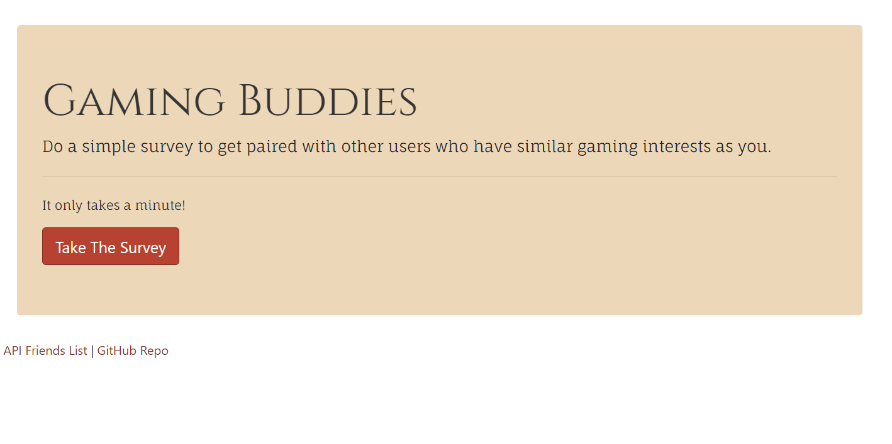

# Gaming Buddies / Friend Finder

## About This Project

The goal of this app was to create a friend finder (essentially a dating app) application using Node.js and Express servers. The user may take a short 10 question survey on their preferences for tabletop games, and then they are paired with other users who have filled out the survey based on the similarity of their scores in the survey. 

## Demo

Gaming Buddies is deployed to Heroku, please check it out here: [Gaming Buddies](https://salty-cliffs-74583.herokuapp.com/ "Gaming Buddies")

## Technologies Used

- Javascript
- jQuery
- Node.js
- Bootstrap
- Express.js
- HTML5 and CSS3

## Installation

To install this project locally, enter the following in Git Bash:

    git clone git@github.com:MadeleineGriggs/Gaming-Buddies.git
    cd friend-finder
    npm install

To run the application locally and access it in your browser, set your PORT value in the server.js file to a value of your choice, or keep the default value of 8080.
Then run the command:

`node app/server.js`

To start your application on the local host. 

## Screenshots

